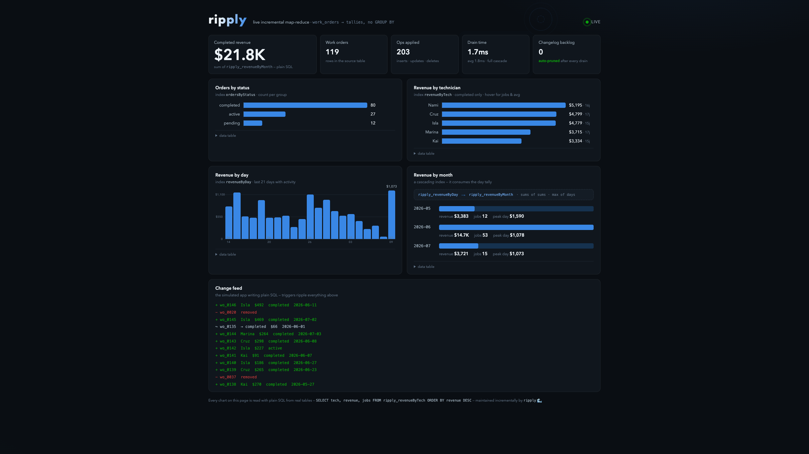

# Ripply 🌊

**Real-time incremental map-reduce indexes for SQLite and Postgres.**

Pre-computed, always-fresh aggregates — counts by status, revenue by month,
workload by assignee — maintained incrementally as your rows change. Inserts,
updates, **and deletes**. Query time is a key lookup, never a `GROUP BY` scan.

Inspired by RavenDB's map-reduce indexes; built as a small standalone
TypeScript library for Bun/Node. No framework, no server, no lock-in.

```ts
import { createRipply } from "ripply";
import { sqliteSource, sqliteStore } from "ripply/sqlite";

const ripply = createRipply({
  source: sqliteSource({ db, collections: { work_orders: { pk: ["id"] } } }),
  store: sqliteStore({ db }),
});

ripply.defineIndex("countByStatus", {
  collection: "work_orders",
  map: (wo) => ({ status: wo.status, count: 1 }),
  reduce: { groupBy: ["status"], aggregate: { count: "sum" } },
});

await ripply.start(); // installs change capture, processes incrementally

await ripply.index("countByStatus").all();
// [{ status: "pending", count: 49 }, { status: "completed", count: 20 }, ...]

// Update a row → the affected groups update in real time. Delete one → the
// tally goes down. No rescans.
```

**The tally is a real table.** Every index materializes as `ripply_<name>`
with your groupBy fields and aggregates as plain columns — query it with any
SQL client, no Ripply required, and declare ordinary SQL indexes on it:

```sql
SELECT tech, revenue, jobs FROM ripply_revenueByTech ORDER BY revenue DESC;
```

**And a tally can feed another index.** Cascading rollups (RavenDB 4's
OutputReduceToCollection), incremental all the way down:

```ts
ripply.defineIndex("revenueByMonth", {
  collection: "ripply_revenueByDay", // ← another index's output table
  map: (day) => ({ month: day.day.slice(0, 7), revenue: day.revenue }),
  reduce: { groupBy: ["month"], aggregate: { revenue: "sum" } },
});
```

## Live demo

```bash
bun examples/work-orders/server.ts   # → http://localhost:4242
```



Random inserts/updates/deletes ripple through four indexes (including a
day→month cascade) in ~2ms per drain, with the changelog auto-pruned to zero.

## How it works

1. **Capture** — SQLite: generated triggers append to a changelog table.
   Postgres: trigger-outbox (default) or logical-decoding CDC (opt-in).
2. **Map** — each changed row is mapped to zero-or-more index entries.
3. **Reconcile** — the row's *previous* contribution is read from Ripply's own
   entries table and reconciled toward the new one. Linear aggregates
   (`sum`/`count`/`avg`) apply O(1) deltas; non-linear (`min`/`max`/`distinct`)
   re-reduce just the affected group from its entries.
4. **Drill down** — the intermediate entries are queryable: not just
   "49 pending," but *which* 49.

Reprocessing is idempotent by construction, so crashes and replays never
corrupt an index. When source and store share a database, updates are
exactly-once and transactional.

## Status

🚧 Early development, moving fast. **Phases 0, 1, and 2 complete:**

- Backend-free engine proven by property-based invariant tests (incremental
  result == full rebuild over random op sequences), idempotent replay,
  crash-safety, and map-versioning tests
- **SQLite adapter** — generated trigger capture, transactional store,
  materialized tally tables, cascading indexes
- **Postgres adapter** — one generic trigger-outbox capture function, typed
  materialized tally tables (`columnTypes` overrides), and
  **snapshot-windowed cursors**: polling that provably never skips a
  transaction that commits out of BIGSERIAL order (a held-transaction test
  and a concurrent-writers stress test enforce it). Zero dependencies —
  built on Bun's native `Bun.sql`. Works great on hosted Postgres (Neon):
  no replication slots, no WAL retention, survives connection pooling.
- The **identical invariant suite** runs against the in-memory reference,
  real SQLite, and real Postgres — 60 tests green
- **Verified against RavenDB itself**: a production RavenDB map-reduce index
  ported to Ripply over 452 live documents produced exactly matching reduce
  groups (`scripts/ravendb-oracle.ts`)

**Next: ergonomics** (compiled build, drill-down polish) and opt-in
logical-decoding CDC. See `PLAN.md`.

⚠️ Published as TypeScript source (Bun-first) while pre-1.0; a compiled build
lands with the ergonomics phase.

## License

MIT © [Claudia](https://github.com/iamclaudia-ai)

---

*Built with 💙 by Michael & Claudia*
